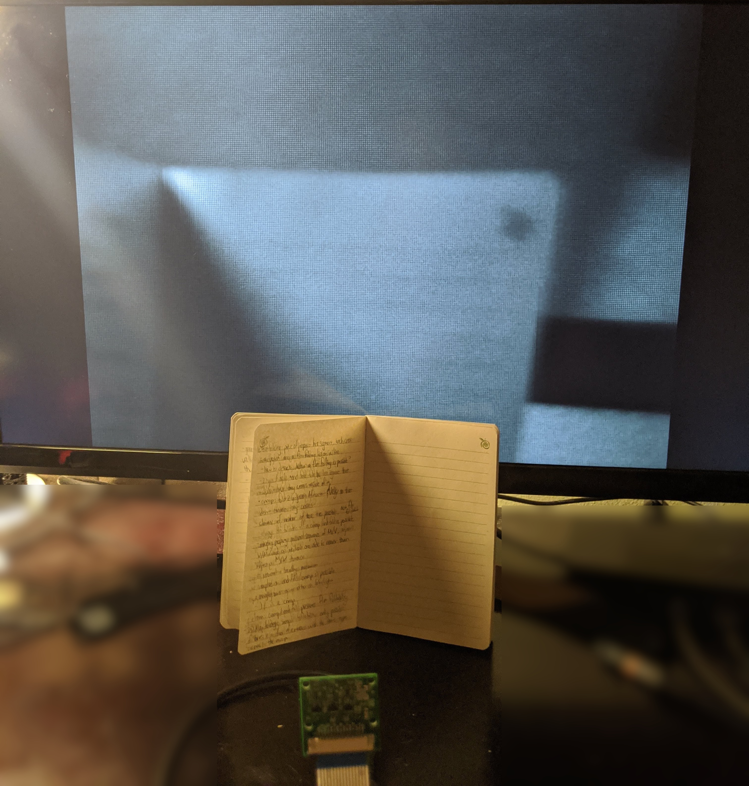

# mipi-demo

Live stream frames from a Raspberry Pi Camera v1.1 (OV5647) over HDMI.

Cumulative demonstration of a year-long journey working on the following projects:

* [hdl-util/hdmi](https://github.com/hdl-util/hdmi/): video/audio transmission over [HDMI](https://en.wikipedia.org/wiki/HDMI)
* [hdl-util/mipi-ccs](https://github.com/hdl-util/mipi-ccs): camera control with [MIPI CCS](https://www.mipi.org/specifications/camera-command-set)
    * [hdl-util/i2c](https://github.com/hdl-util/i2c): [I2C](https://en.wikipedia.org/wiki/I%C2%B2C) master
* [hdl-util/mipi-csi-2](https://github.com/hdl-util/mipi-csi-2): camera video reception with [MIPI CSI 2](https://www.mipi.org/specifications/csi-2) 
* [hdl-util/sdram-controller](https://github.com/hdl-util/sdram-controller/): generic [SDRAM](https://en.wikipedia.org/wiki/Synchronous_dynamic_random-access_memory) controller
* [hdl-util/clock-domain-crossing](https://github.com/hdl-util/clock-domain-crossing): utilities for [clock domain crossing](https://en.wikipedia.org/wiki/Clock_domain_crossing) on FPGAs
    * [hdl-util/gray-code](https://github.com/hdl-util/gray-code): arbitrary width [Gray codes](https://en.wikipedia.org/wiki/Gray_code)

## Demo

Picture taken with a Pixel 3a of an OV5647 video stream on an LG 4K monitor at 640x480 resolution:

Please forgive the horrible focus of the image, I'm using a knockoff OV5647 module with fixed-focus.
The image is received in RAW8 format and hasn't been processed yet, hence the lack of color.

## What's next?

* [Demosaicing](https://en.wikipedia.org/wiki/Bayer_filter#Demosaicing)
* IMX219 control
  * This is commonly available as the [Raspberry Pi Camera Module v2](https://www.raspberrypi.org/products/camera-module-v2/)
* SDRAM controller improvements
* much more!

## Special thanks

* Gaurav Singh for his [excellent blog post discussing a MIPI CSI 4-lane configuration](https://www.circuitvalley.com/2020/02/imx219-camera-mipi-csi-receiver-fpga-lattice-raspberry-pi-camera.html)
